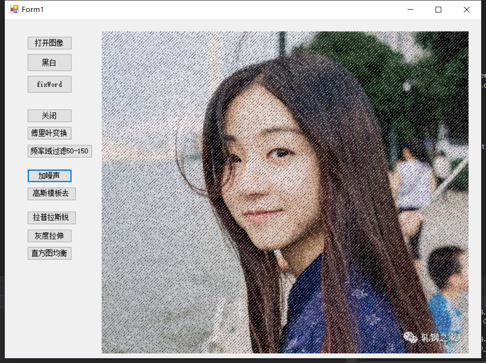
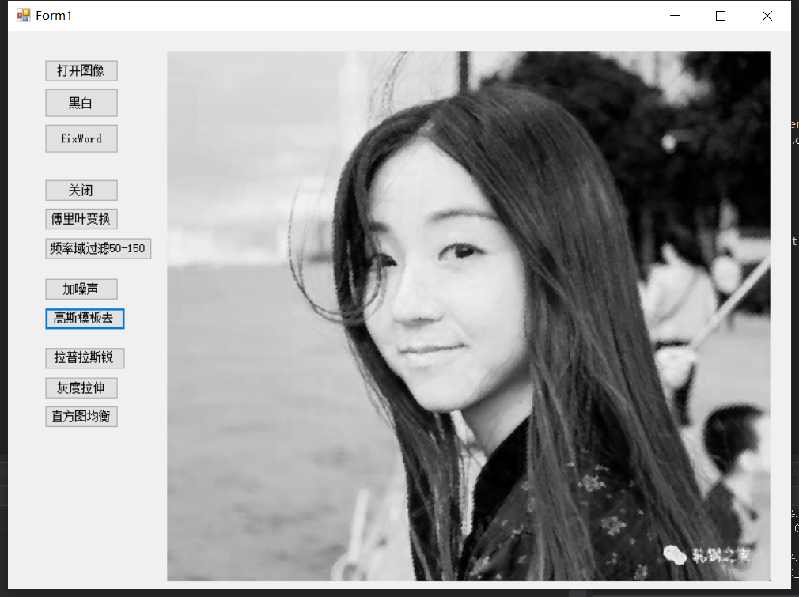

# ImageOperation
数字图像处理
1.	打开图像，显示图像，存储图像；对一张图像进行缩放，观察其分辨率，降低灰度分辨率
2.	打开一副低对比度图像，拉伸其图像，直方图均衡
3.	对一副图像加噪声，进行平滑，锐化作用
4.	对一副图像进行傅立叶变换，显示频谱，取其5，50，150为截至频率，进行频率域平滑，锐化，显示图像
5.	对一副图像加噪，进行几何均值，算术均值，谐波，逆谐波处理
6.	提取一副彩色图像中红色，用HIS模型处理
7.	对一副二值图像进行膨胀、腐蚀、开、闭操作
8.	对一副图像进行二值化，ostu算法等

部分结果截图
<h3>加噪声</h3>

</img>

<h3>去噪声</h3>

</img>

